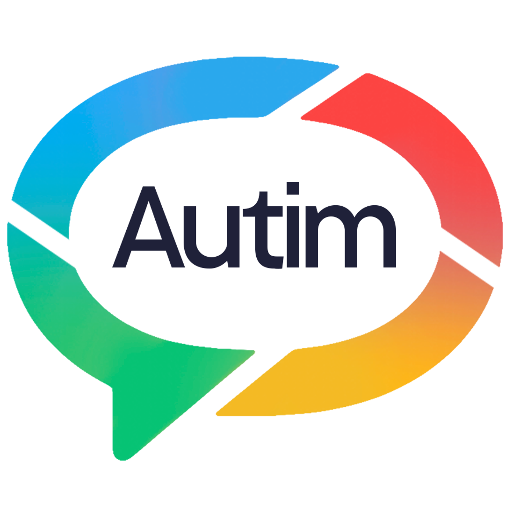

# 🧩 Autim | Inclusão Inteligente

<picture>
  <source media="(prefers-color-scheme: dark)" srcset="Imagens/logo-preta.png">
  <source media="(prefers-color-scheme: light)" srcset="Imagens/logo-branca.png">
  
</picture>

> Plataforma de comunicação assistiva para pessoas com TEA não verbais, utilizando IA para adaptação personalizada.

🚀 **Projeto Integrador** | 2º ADS-AMS - FATEC TAUBATÉ
<br>
Foco: Inclusão, acessibilidade e tecnologia adaptativa

## 🤩 Missão do Produto

* Prover voz, autonomia e inclusão para pessoas autistas não verbais por meio de uma arquitetura tecnológica adaptativa. Nossa missão é romper barreiras comunicativas e pedagógicas, transformando a interação humana através de uma interface intuitiva que respeita a neurodiversidade e elimina a sobrecarga sensorial.

## ❗ Problema

Pessoas autistas não verbais enfrentam dificuldades na comunicação e no aprendizado, muitas vezes dependendo de ferramentas pouco adaptativas e interfaces sobrecarregadas.

## Descrição da Solução

* O Autim é um ecossistema multimodal que integra:
- Comunicação assistiva e aprendizado personalizado.
- Atividades adaptativas com base em IA
- Monitoramento automático ao nível das atividades conforme o progresso do usuário.
- Conexão entre alunos, responsáveis e profissionais

---

### 🛠️ Engenharia e Escopo

> **Funcionalidades**

- 🗣️ Comunicação por símbolos com reprodução de áudio
- 🤖 Bot que auxiliará no uso da plataforma e a como lidar com o Autista
- 📊 Dashboard de acompanhamento de progresso
- 👤 Sistema de perfis (Admin, Profissional, Aluno)
- 🖼️ Biblioteca de mídias personalizadas

## 🏗️ Arquitetura do Sistema

| Camada | Tecnologias / Ferramentas / Pacotes |
| :--- | :--- |
| **Frontend (Web & Desktop)** | React.js, Electron, Vite, HTML5, CSS3, JavaScript |
| **Mobile** | React Native |
| **Backend (Node.js)** | Node.js, Express.js, PHP, `path`, `fs` |
| **Banco de Dados** | MySQL (driver `mysql2`) |
| **Autenticação & Segurança** | JSON Web Tokens (JWT), Bcrypt.js, CORS, Dotenv, Certificado SSL (HTTPS) |
| **Comunicação / Protocolo** | API REST (HTTPS / JSON) |
| **Infraestrutura & Web Server** | NGINX (Reverse Proxy / SSL), VPS Hostgator (Produção), XAMPP (Dev Local) |
| **Design & UI/UX** | Figma, Adobe Photoshop, Canva |
| **Ferramentas de Desenvolvimento** | Visual Studio Code, Git, GitHub |

---

*Diagramas Autim*
[DiagramasAUTIMM.pdf](https://github.com/user-attachments/files/27103746/DiagramasAUTIMM.pdf)

> **▶️ Como executar**

**Pré-requisitos:** Node.js e MySQL instalados.

```bash
# Clone o repositório
git clone https://github.com/gijandira/PI-2ams

# Entre na pasta
cd autim

# Instale dependências (frontend)
npm install

# Rode o projeto
npm start
```

Para instruções detalhadas de backend e configuração do banco de dados, consulte o arquivo [Funcionar o projeto.txt](autimm/Funcionar%20o%20projeto.txt) dentro da pasta `autimm/`.

> **🔒 Segurança**

O sistema segue princípios da LGPD, garantindo:
- Criptografia de dados sensíveis
- Controle de acesso por perfil
- Proteção de informações dos usuários

## 🚀 Tecnologias Utilizadas

### 💻 Frontend & Mobile


### ⚙️ Backend & Banco de Dados


### 🌐 Servidor & Infraestrutura


### 🛠️ Ferramentas & Design


## 📅 Planejamento de Entregas

| Sprint | Descrição | Período | Status |
|--------|-----------|---------|--------|
| Sprint 1 | Base do sistema | 24/03/2026 – 24/04/2026 | ✅ Concluída |
| Sprint 2 | Testes e Validação | 01/05/2026 – 31/05/2026 | ✅ Concluída |
| Sprint 3 | Correções e Apresentação | 01/06/2026 – 30/06/2026 | 🔄 Em andamento |
| Sprint 4 | Integrações | — | ⏳ Pendente |
| Sprint 5 | Finalização | — | ⏳ Pendente |

## 📁 Estrutura do Repositório

PI-2ams/
├── autim/ # Código principal do sistema
├── backend/ # Configurações do backend
├── utilitários de backend/ # Utilitários de suporte ao backend
├── front-end/ # Código do frontend
├── banco de dados/ # Documentação do banco de dados
├── documentos/ # Documentações do projeto
├── Imagens/ # Imagens utilizadas no README
├── CHANGELOG.md # Histórico de alterações por Sprint
├── LICENÇA.txt # Licença de uso do projeto
├── arquivo package-lock.json # Dependências do projeto
├── package.json # Configurações do projeto
└── README.md # Documentação principal

## 👥 Equipe

### 🎯 Gestão

| Nome | Função | GitHub | LinkedIn |
| :--- | :--- | :---: | :---: |
| Giovanna Yasmin | Product Owner | — | — |
| Giovana Levindo | Scrum Master | — | — |

### 🖥️ Frontend

| Nome | Função | GitHub | LinkedIn |
| :--- | :--- | :---: | :---: |
| Iran Freitas ⭐ | Dev Frontend / Porta-voz | — | — |
| Flávio Augusto | Dev Frontend | — | — |
| Rodrigo Cunha | Dev Frontend | — | — |

### ⚙️ Backend

| Nome | Função | GitHub | LinkedIn |
| :--- | :--- | :---: | :---: |
| Lucas Lica ⭐ | Dev Backend / Porta-voz | — | — |
| Vitor Gouvea | Dev Backend | — | — |
| Vinicius Gouvea | Dev Backend | — | — |
| João Vitor da Mota | Dev Backend | — | — |
| Daniel Moreira | Dev Backend | — | — |
| Gustavo Duran | Dev Backend | — | — |

### 🏗️ Infraestrutura

| Nome | Função | GitHub | LinkedIn |
| :--- | :--- | :---: | :---: |
| Giovana Jandira ⭐ | Infraestrutura / Porta-voz | — | — |
| Felipe Caitano | Infraestrutura | — | — |
| Glenda Lopes | Infraestrutura | — | — |
| João Vitor Alvarenga | Infraestrutura | — | — |
| Alex Sander | Infraestrutura | — | — |

> ⭐ Porta-voz do time

> *"A empatia é ver com os olhos do outro, ouvir com os ouvidos do outro e sentir com o coração do outro."*
> — Alfred Adler

**FATEC TAUBATÉ - 2026 | 2° ADS/AMS**
